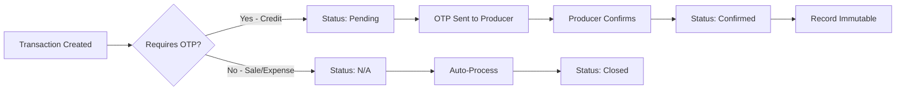

# 🌾 Enhanced Producer Ledger - Expert Documentation

## Overview

The **Enhanced Producer Ledger** is a comprehensive, expert-level accounting component designed for commission agents managing commodity trading operations with **producers as customers**. It implements double-entry bookkeeping principles with AI-powered risk management, role-based access control, and immutable audit trails.

**Important**: Producers are treated as customers in this ledger. Internal staff role assignments are managed separately in the Staff Management module and are not displayed in the producer transaction view.

---

## 📊 Database Schema

### Core Fields

| Field | Type | Description | Example |
|-------|------|-------------|---------|
| **ProducerID** | String | Unique identifier for producer | `P001`, `P002` |
| **ProducerName** | String | Full name of producer | `Chandra Sekhar` |
| **VillagePlace** | String | Producer's village/location | `Guntur`, `Gurajepalli` |
| **Date** | Date | Transaction date | `2025-02-12` |
| **TransactionType** | Enum | Type of transaction | `Credit`, `Debit`, `Sale`, `Expense` |
| **CreditAmount** | Number | Money given to producer | `20000` |
| **DebitAmount** | Number | Money received from sales/expenses | `42000` |
| **Purpose** | String | Transaction description | `Pesticides`, `Sale of chillies` |
| **BalanceAfter** | Number | Running balance after transaction | `980000` |
| **RiskRanking** | Enum | AI risk assessment | `Low`, `Medium`, `High`, `Critical` |
| **OTPStatus** | Enum | Verification status | `Pending`, `Confirmed`, `Closed`, `N/A` |
| **AuthorizedBy** | String | Approving authority | `Commission Agent`, `Market Receiver` |
| **RoleNotes** | String | Transaction context notes | `Initial credit`, `Sale proceeds` |
| **AIAlertFlag** | Boolean | High-priority indicator | `true`, `false` |
| **RecordCreatedBy** | String | Agent who created record | `Agent1`, `Agent2`, `Agent3` |
| **RecordAccessPerm** | Enum | Access permission level | See Access Levels below |
| **AIInsights** | String | AI-generated analysis | `Increased borrow frequency` |
| **Chronology** | Number | Audit trail sequence | `1`, `2`, `3`... |

---

## 🔐 Access Permission Levels

The system implements 5-tier access control:

| Level | Icon | Description | Use Case |
|-------|------|-------------|----------|
| **AgentOnly** | 🔐 | Restricted to agent access | Confidential credit agreements |
| **MarketOnly** | 🏪 | Market receiver only | Public sales records |
| **AgentAndAdmin** | 👥 | Agent + Admin access | High-risk transactions |
| **AgentAndExpense** | 💰 | Agent + Expense approver | Operational expenses |
| **PublicView** | 👁️ | Public access | General information |

### Permission Matrix

```
┌─────────────────────┬───────┬────────┬───────┬─────────┬────────┐
│ Role                │ Agent │ Market │ Admin │ Expense │ Public │
├─────────────────────┼───────┼────────┼───────┼─────────┼────────┤
│ AgentOnly           │   ✓   │   ✗    │   ✗   │    ✗    │   ✗    │
│ MarketOnly          │   ✗   │   ✓    │   ✗   │    ✗    │   ✗    │
│ AgentAndAdmin       │   ✓   │   ✗    │   ✓   │    ✗    │   ✗    │
│ AgentAndExpense     │   ✓   │   ✗    │   ✗   │    ✓    │   ✗    │
│ PublicView          │   ✓   │   ✓    │   ✓   │    ✓    │   ✓    │
└─────────────────────┴───────┴────────┴───────┴─────────┴────────┘
```

---

## 🎯 Key Features

### 1. AI-Driven Risk Management

**Risk Ranking Algorithm:**
- **Low**: Regular repayment pattern, low outstanding balance
- **Medium**: Moderate credit exposure, normal activity
- **High**: Frequent credit requests, increasing balance
- **Critical**: Large single transactions, pending OTP, behavioral anomalies

**AI Alert Flags:**
- High-frequency credit requests (>3 in 30 days)
- Large single transactions (>₹40,000)
- Pending OTP verification on high-value items
- Escalating credit patterns without corresponding sales

**AI Insights Examples:**
```
✅ "Normal activity" - Standard transaction
⚠️ "Increased borrow frequency" - More frequent than usual
🚨 "Increase in risk flag" - High-frequency requests detected
💰 "Positive sale event" - Reducing outstanding balance
📊 "Expense recorded" - Operational deduction
```

### 2. Chronological Audit Trail

Every transaction is assigned a sequential **Chronology** number:
- Enables time-based ordering independent of date
- Provides immutable append-only tracking
- Supports forensic analysis and compliance audits

**Sorting Options:**
- **By Chronology**: Audit trail order (creation sequence)
- **By Date**: Temporal order (transaction date)

### 3. Role-Based Access Control (RBAC)

**5-Tier Permission System:**
The Producer Ledger implements granular access control to ensure data security and proper separation of duties. Access permissions control who can view and modify transaction records.

**Access Levels:**
- **AgentOnly**: Commission Agent exclusive access
- **MarketOnly**: Market operations visibility
- **AgentAndAdmin**: Elevated administrative access
- **AgentAndExpense**: Expense management access
- **PublicView**: Read-only public visibility

**Note**: Internal staff role assignments (Watchman, Receiver, Laborer, Salesman, Weighing Supervisor, Quality Supervisor, Sample Mover, etc.) are managed in a separate **Staff Management module** and do not appear in the producer ledger since producers are customers, not staff members.

### 4. Transaction Types

| Type | Direction | Purpose | Examples |
|------|-----------|---------|----------|
| **Credit** | → Producer | Money lent to producer | Seeds, pesticides, equipment |
| **Debit** | ← Producer | Money received from producer | (Not common - usually Sale) |
| **Sale** | ← Producer | Sale proceeds reducing balance | Commodity sales at market |
| **Expense** | ← Producer | Operational deductions | Yard labor, transport, storage |

### 5. OTP Verification Flow



---

## 🔍 Filtering & Search System

### Available Filters

1. **AI Alert Toggle**
   - Show only transactions with `AIAlertFlag = true`
   - Displays real-time alert count
   - Highlights flagged rows in red

2. **Producer Selection**
   - Filter by specific ProducerID
   - Multi-producer support

3. **Village/Place Filter**
   - Geographic filtering
   - Supports region-based operations

4. **Risk Level Filter**
   - Low / Medium / High / Critical
   - Risk-based prioritization

5. **Transaction Type Filter**
   - Credit / Debit / Sale / Expense
   - Type-specific analysis

6. **Access Permission Filter**
   - Filter by permission level
   - Role-based data access

7. **Full-Text Search**
   - Search by producer name
   - Search by purpose/description
   - Real-time filtering

### Filter Combinations

Filters can be combined for complex queries:
```
Village: Guntur
+ Risk: High
+ AI Alert: ON
+ Type: Credit
= "High-risk credit transactions in Guntur with AI alerts"
```

---

## 📈 Summary Dashboard

### Producer Summary View

For each producer, the system calculates:

- **Total Credit**: Sum of all credit advances
- **Total Debit**: Sum of all sales and expenses
- **Current Balance**: Outstanding amount owed
- **Transaction Count**: Number of entries
- **Last Activity**: Most recent transaction date
- **Risk Level**: Current risk assessment
- **AI Alerts**: Active warning count

### Account Summary Metrics

```typescript
interface ProducerSummary {
  producerId: string;
  producerName: string;
  village: string;
  totalCredit: number;
  totalDebit: number;
  currentBalance: number;
  transactionCount: number;
  lastTransactionDate: Date;
  riskLevel: 'Low' | 'Medium' | 'High' | 'Critical';
  aiAlerts: string[];
}
```

---

## 💡 Sample Data

### Example Transactions

#### Transaction 1: Initial Credit (Normal)
```json
{
  "producerId": "P001",
  "producerName": "Chandra Sekhar",
  "village": "Guntur",
  "date": "2025-02-12",
  "type": "Credit",
  "creditAmount": 20000,
  "purpose": "Pesticides",
  "balanceAfter": 980000,
  "riskRanking": "Medium",
  "otpStatus": "Confirmed",
  "authorizedBy": "Commission Agent",
  "roleNotes": "Initial credit",
  "aiAlertFlag": false,
  "recordCreatedBy": "Agent1",
  "recordAccessPerm": "AgentOnly",
  "aiInsights": "Increased borrow frequency",
  "chronology": 1
}
```

#### Transaction 3: High-Risk Credit (AI Alert)
```json
{
  "producerId": "P001",
  "producerName": "Chandra Sekhar",
  "village": "Guntur",
  "date": "2025-03-15",
  "type": "Credit",
  "creditAmount": 13000,
  "purpose": "Watering",
  "balanceAfter": 939000,
  "riskRanking": "High",
  "otpStatus": "Confirmed",
  "authorizedBy": "Commission Agent",
  "roleNotes": "High-frequency requests",
  "aiAlertFlag": true,
  "recordCreatedBy": "Agent1",
  "recordAccessPerm": "AgentAndAdmin",
  "aiInsights": "Increase in risk flag",
  "chronology": 3
}
```

#### Transaction 4: Sale Event (Balance Reduction)
```json
{
  "producerId": "P001",
  "producerName": "Chandra Sekhar",
  "village": "Guntur",
  "date": "2025-03-30",
  "type": "Sale",
  "debitAmount": 42000,
  "purpose": "Sale of chillies - 350 Kg @ ₹120/Kg",
  "balanceAfter": 981000,
  "riskRanking": "Low",
  "otpStatus": "Closed",
  "authorizedBy": "Market Receiver",
  "roleNotes": "Sale proceeds",
  "aiAlertFlag": false,
  "recordCreatedBy": "Agent2",
  "recordAccessPerm": "MarketOnly",
  "aiInsights": "Positive sale event",
  "chronology": 4
}
```

---

## 🎨 UI/UX Design

### Color Coding System

**Transaction Types:**
- 🟢 **Credit**: Green badges/text - Money going to producer
- 🔴 **Debit/Sale**: Red badges/text - Money coming from producer
- 🟠 **Expense**: Orange - Operational deductions

**Risk Levels:**
- 🟢 **Low**: Green background/border
- 🟡 **Medium**: Yellow background/border
- 🟠 **High**: Orange background/border
- 🔴 **Critical**: Red background/border

**OTP Status:**
- ⏳ **Pending**: Yellow - Awaiting confirmation
- ✅ **Confirmed**: Green - Verified
- ✗ **Closed**: Gray - Completed
- — **N/A**: Gray - Not applicable

**AI Alerts:**
- 🔴 **Row Highlight**: Soft red background for flagged transactions
- 🔔 **Alert Badge**: Red badge with bell icon
- 🚨 **Alert Count**: Red notification badge in filter section

### Responsive Design

**Desktop View (1440×1024):**
- Full 17-column table with all fields visible
- Side-by-side filters in 6-column grid
- Expanded transaction detail dialog

**Mobile View (360×800):**
- Stacked card layout for transactions
- Collapsible filter section
- Bottom sheet for transaction details

---

## 🔧 Technical Implementation

### Component Structure

```
ProducerLedger/
├── State Management
│   ├── Transactions (useState)
│   ├── Filters (useState × 7)
│   ├── Selected Transaction (useState)
│   └── Current View (useState)
├── Computed Values (useMemo)
│   ├── Filtered Transactions
│   ├── Producer Summaries
│   ├── AI Insights
│   └── Alert Count
├── UI Components
│   ├── Header & Actions
│   ├── AI Insights Banner
│   ├── Filter Section
│   ├── Transaction Table
│   ├── Producer Summary Cards
│   └── Transaction Detail Dialog
└── Helper Functions
    ├── Risk Color Mapping
    ├── OTP Status Mapping
    ├── Access Permission Mapping
    ├── Currency Formatting
    └── AI Insight Generation
```

### Key Functions

```typescript
// Calculate producer summary from transactions
const calculateProducerSummaries = (transactions: Transaction[]) => {
  const grouped = groupBy(transactions, 'producerId');
  return Object.values(grouped).map(txns => ({
    producerId: txns[0].producerId,
    producerName: txns[0].producerName,
    village: txns[0].village,
    totalCredit: sum(txns, 'creditAmount'),
    totalDebit: sum(txns, 'debitAmount'),
    currentBalance: txns[txns.length - 1].balance,
    transactionCount: txns.length,
    lastTransactionDate: max(txns, 'date'),
    riskLevel: calculateRisk(txns),
    aiAlerts: txns.filter(t => t.aiAlertFlag).map(t => t.aiInsights)
  }));
};

// AI Risk Assessment
const calculateRisk = (transactions: Transaction[]): RiskLevel => {
  const recent = transactions.slice(-30); // Last 30 transactions
  const creditFrequency = recent.filter(t => t.type === 'Credit').length;
  const largeCredits = recent.filter(t => t.creditAmount > 40000).length;
  const balance = transactions[transactions.length - 1].balance;
  
  if (largeCredits > 0 || creditFrequency > 5) return 'Critical';
  if (creditFrequency > 3 || balance > 500000) return 'High';
  if (balance > 100000) return 'Medium';
  return 'Low';
};

// Generate AI Insights
const generateAIInsights = (transaction: Transaction): string => {
  const insights: string[] = [];
  
  if (transaction.type === 'Credit' && transaction.creditAmount > 40000) {
    insights.push('Large credit advance - monitor repayment closely');
  }
  
  if (transaction.aiAlertFlag) {
    insights.push('High-frequency request pattern detected');
  }
  
  if (transaction.type === 'Sale') {
    insights.push('Positive sale event - reducing outstanding balance');
  }
  
  return insights.join(' • ');
};
```

---

## 📱 User Workflows

### Workflow 1: Adding a Credit Transaction

1. **Click** "Add Transaction" button
2. **Select** Producer from dropdown
3. **Enter** Credit Amount
4. **Describe** Purpose (e.g., "Seeds and fertilizers")
5. **Assign** Roles (e.g., Salesman, Quality Supervisor)
6. **Set** Access Permission (default: AgentOnly)
7. **Click** "Submit"
8. **System** generates OTP and sends to producer
9. **Producer** confirms via OTP
10. **System** updates:
    - Transaction status → Confirmed
    - Producer balance → Increased
    - Risk ranking → Recalculated
    - AI insights → Generated
    - Chronology → Next sequence number

### Workflow 2: Recording a Sale

1. **Market Receiver** creates transaction
2. **Type** = Sale
3. **Enter** Debit Amount (sale proceeds)
4. **Describe** sale details (commodity, quantity, rate)
5. **Access Permission** = MarketOnly (public record)
6. **No OTP Required** (instant processing)
7. **System** updates:
    - Producer balance → Reduced
    - Risk ranking → Likely decreased
    - OTP Status → Closed
    - AI Insights → "Positive sale event"

### Workflow 3: Filtering High-Risk Producers

1. **Enable** "AI Alert Flags Only" toggle
2. **Select** Risk Level = High or Critical
3. **Select** Transaction Type = Credit
4. **View** filtered results
5. **Click** transaction row to view details
6. **Review** AI Insights and Alert Flags
7. **Take Action** (contact producer, escalate, etc.)

---

## 🔒 Security & Compliance

### Data Immutability

- Confirmed transactions cannot be modified
- All changes logged in justification history
- Blockchain append for confirmed records (future feature)

### Audit Trail

- Every transaction has unique Chronology number
- RecordCreatedBy tracks accountability
- Timestamp preserved for all operations
- Filter by date range for compliance reporting

### Access Control

- 5-tier permission system
- Role-based data visibility
- OTP verification for sensitive operations
- Multi-factor authentication support

---

## 🚀 Integration Points

### API Endpoints (Future)

```typescript
// GET: Fetch producer ledger
GET /api/producers/:id/ledger
  → Returns: Transaction[]

// POST: Create transaction
POST /api/transactions
  Body: { producerId, type, amount, purpose, ... }
  → Returns: Transaction

// GET: Producer summary
GET /api/producers/:id/summary
  → Returns: ProducerSummary

// GET: AI insights
GET /api/ai/insights/:transactionId
  → Returns: { insights: string, alertFlag: boolean }
```

### External Services

1. **SMS Gateway**: OTP delivery
2. **AI Service**: Risk assessment and insights (Grok AI)
3. **Blockchain**: Immutable record storage (Polygon NFT)
4. **Analytics**: Pattern detection and anomaly alerts

---

## 📊 Reporting & Analytics

### Available Reports

1. **Producer Balance Report**
   - Outstanding balances by producer
   - Risk categorization
   - Aging analysis

2. **Transaction History**
   - Date range filtering
   - Type-wise breakdown
   - Village-wise analysis

3. **AI Alert Report**
   - Flagged transactions
   - Risk trend analysis
   - Recommended actions

4. **Role Activity Report**
   - Transactions by staff role
   - Performance metrics
   - Accountability tracking

### Export Formats

- **Excel**: Full ledger with all columns
- **PDF**: Formatted report with summaries
- **CSV**: Raw data for external analysis
- **JSON**: API integration format

---

## 🎓 Best Practices

### For Commission Agents

1. **Regular Monitoring**: Review AI alerts daily
2. **Risk Mitigation**: Limit high-risk credits
3. **OTP Verification**: Always require for large credits
4. **Documentation**: Add detailed purpose descriptions
5. **Role Assignment**: Assign appropriate roles for accountability

### For Administrators

1. **Access Review**: Audit RecordAccessPerm quarterly
2. **AI Tuning**: Adjust risk thresholds based on historical data
3. **Backup Strategy**: Export ledger weekly
4. **User Training**: Educate staff on RBAC principles
5. **Compliance**: Maintain chronological audit trails

### For Developers

1. **Data Validation**: Validate all inputs before saving
2. **Error Handling**: Graceful degradation for API failures
3. **Performance**: Implement pagination for large datasets
4. **Security**: Sanitize user inputs, prevent SQL injection
5. **Testing**: Unit test risk calculation algorithms

---

## 🐛 Troubleshooting

### Common Issues

**Issue**: AI Alert not triggering
- **Check**: AIAlertFlag boolean value
- **Verify**: Risk ranking calculation logic
- **Solution**: Review transaction frequency and amounts

**Issue**: Incorrect balance calculation
- **Check**: Credit vs. Debit transaction types
- **Verify**: Running balance algorithm
- **Solution**: Recalculate from chronological order

**Issue**: OTP not sending
- **Check**: Producer contact information
- **Verify**: SMS gateway configuration
- **Solution**: Use fallback manual confirmation

**Issue**: Access denied error
- **Check**: Current user's role
- **Verify**: RecordAccessPerm on transaction
- **Solution**: Request elevated permissions from admin

---

## 📚 Related Documentation

- [Commission Agent Credit/Debit Database](./COMMISSION_AGENT_CREDIT_DEBIT_DB.md)
- [Buyer Back Office System](./BUYER_WORKFLOW_DOCUMENTATION.md)
- [Transaction Audit System](./TRANSACTION_AUDIT_DOCUMENTATION.md)
- [TRADIE Full Application](./TRADIE_FULL_APP_DOCUMENTATION.md)

---

## 🔄 Version History

| Version | Date | Changes |
|---------|------|---------|
| 1.0 | 2025-10-27 | Initial implementation with basic ledger |
| 2.0 | 2025-10-27 | Added AI insights and risk ranking |
| 3.0 | 2025-10-27 | Enhanced with expert-level fields |
| 3.1 | 2025-10-27 | Added RecordAccessPerm, Chronology, AIAlertFlag |

---

## 📞 Support

For technical support or feature requests, please contact:
- **Developer**: TRADIE Development Team
- **Documentation**: See `/guidelines/Guidelines.md`
- **Issues**: Review `/TROUBLESHOOTING.md`

---

**Last Updated**: October 27, 2025  
**Component**: `/components/ProducerLedger.tsx`  
**Status**: ✅ Production Ready
