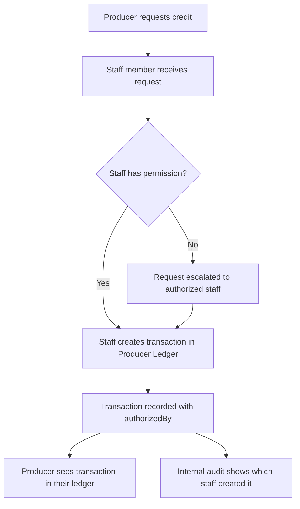

# 🔗 Two-Table Integration Guide
## Producer Ledger + Staff Management

### Date: October 28, 2025
### Architecture: Normalized Two-Table Design

---

## 📋 Executive Summary

This guide explains how the **Producer Ledger** (customer transactions) and **Staff Management** (internal operations) tables work together in the TRADIE system while maintaining clean separation of concerns.

---

## 🎯 Design Principles

### 1. **Clear Separation**
```
┌─────────────────────┐         ┌─────────────────────┐
│  PRODUCER LEDGER    │         │  STAFF MANAGEMENT   │
│  (Customer View)    │         │  (Internal View)    │
├─────────────────────┤         ├─────────────────────┤
│ ✅ Transactions     │         │ ✅ Staff Directory  │
│ ✅ Balances         │         │ ✅ Role Assignments │
│ ✅ Risk Levels      │         │ ✅ Permissions      │
│ ✅ AI Insights      │         │ ✅ Village Links    │
│ ❌ NO Staff Roles   │         │ ❌ NO Customer Data │
└─────────────────────┘         └─────────────────────┘
```

### 2. **Access Control**
- **Producer Ledger**: Visible to producers (own data) and agents (all data)
- **Staff Management**: Visible ONLY to commission agents and admins

### 3. **Data Flow**
```
Producer Transaction → Created by Agent → Logged in Producer Ledger
                                              ↓
                                         authorizedBy: "Agent Name"
                                         recordCreatedBy: "Agent ID"
                                              
Staff Member → Assigned roles → Stored in Staff Management
                                              ↓
                                         Can perform operations
                                         Based on permissions
```

---

## 📊 Complete Data Example

### Example Transaction in Producer Ledger
```typescript
// Transaction record (Customer facing)
{
  producerId: 1,
  producerName: "Chandra Sekhar",
  villagePlace: "Guntur",
  date: "2025-02-12",
  transactionType: "Credit",
  creditAmount: 20000.00,
  debitAmount: null,
  purpose: "Pesticides",
  balanceAfter: 980000.00,
  riskRanking: "Medium",
  otpStatus: "Confirmed",
  authorizedBy: "Commission Agent",  // ✅ Who approved
  roleNotes: "Initial credit",       // ✅ Transaction context
  aiAlertFlag: false,
  recordCreatedBy: "Agent1",         // ✅ Who created
  recordAccessPerm: "AgentOnly",
  aiInsights: "Increased borrow frequency",
  chronology: 1
}
```

**What the producer sees**: Transaction details, balance, risk level, who approved  
**What the producer does NOT see**: Which specific staff member handled it (internal operation)

### Corresponding Staff Record
```typescript
// Staff member record (Internal only)
{
  staffId: "ST101",
  staffName: "G. Rama Rao",
  assignedRoles: ["Salesman", "Weighing Laborer"],
  permissions: ["MarketOnly"],
  associatedVillage: "Guntur",
  activeStatus: "Active",
  notes: "Main market handler",
  contactNumber: "+91 98765 43210",
  joinDate: "2024-01-15",
  lastModified: "2025-03-15",
  modifiedBy: "Agent1"
}
```

**Who can see this**: Commission agents, admins  
**Who cannot see this**: Producers, external users

---

## 🔄 Common Workflows

### Workflow 1: Create New Transaction



**Code Example:**
```typescript
// Step 1: Verify staff has permission
const staff = await getStaffMember('ST101');
if (!staff.permissions.includes('MarketOnly')) {
  throw new Error('Insufficient permissions');
}

// Step 2: Create transaction (NO staff roles in transaction)
const transaction = await createTransaction({
  producerId: 1,
  transactionType: 'Credit',
  creditAmount: 20000,
  purpose: 'Pesticides',
  authorizedBy: 'Commission Agent',
  roleNotes: 'Initial credit',
  recordCreatedBy: staff.staffId  // Link for audit
});

// Step 3: Optionally log staff assignment (if using bridge table)
await logStaffAssignment({
  transactionId: transaction.chronology,
  staffId: staff.staffId,
  assignmentType: 'Primary'
});
```

### Workflow 2: Producer Views Their Ledger

```typescript
// Customer-facing API endpoint
async function getProducerLedger(producerId: string) {
  // Query ONLY producer_ledger table
  const transactions = await db.query(`
    SELECT 
      ProducerID,
      ProducerName,
      VillagePlace,
      Date,
      TransactionType,
      CreditAmount,
      DebitAmount,
      Purpose,
      BalanceAfter,
      RiskRanking,
      OTPStatus,
      AuthorizedBy,      -- ✅ Shows who approved
      RoleNotes,         -- ✅ Transaction context
      AIAlertFlag,
      AIInsights,
      Chronology
    FROM producer_ledger
    WHERE ProducerID = $1
    ORDER BY Chronology DESC
  `, [producerId]);
  
  // NO staff roles included
  return transactions;
}
```

### Workflow 3: Agent Reviews Staff Performance

```typescript
// Internal API endpoint (agent only)
async function getStaffPerformance(villageFilter?: string) {
  const query = `
    SELECT 
      sr.StaffID,
      sr.StaffName,
      sr.AssignedRoles,
      sr.Permissions,
      sr.AssociatedVillage,
      sr.ActiveStatus,
      COUNT(sa.TransactionID) as TransactionsHandled
    FROM staff_roles sr
    LEFT JOIN staff_assignments sa ON sr.StaffID = sa.StaffID
    WHERE sr.ActiveStatus = 'Active'
      ${villageFilter ? `AND sr.AssociatedVillage = $1` : ''}
    GROUP BY sr.StaffID
    ORDER BY TransactionsHandled DESC
  `;
  
  return await db.query(query, villageFilter ? [villageFilter] : []);
}
```

### Workflow 4: Audit Trail - Who Handled Transaction?

```typescript
// Internal audit function (admin/agent only)
async function getTransactionAudit(chronology: number) {
  const query = `
    SELECT 
      pl.Chronology,
      pl.ProducerName,
      pl.Date,
      pl.TransactionType,
      pl.Purpose,
      pl.AuthorizedBy,
      pl.RecordCreatedBy,
      sr.StaffName,
      sr.AssignedRoles,
      sa.AssignmentType,
      sa.AssignmentDate
    FROM producer_ledger pl
    LEFT JOIN staff_assignments sa ON pl.Chronology = sa.TransactionID
    LEFT JOIN staff_roles sr ON sa.StaffID = sr.StaffID
    WHERE pl.Chronology = $1
  `;
  
  return await db.query(query, [chronology]);
}
```

---

## 🔐 Access Control Implementation

### Database Level (PostgreSQL RLS)

```sql
-- Enable Row Level Security
ALTER TABLE producer_ledger ENABLE ROW LEVEL SECURITY;
ALTER TABLE staff_roles ENABLE ROW LEVEL SECURITY;

-- Producer Ledger Policies
CREATE POLICY producer_own_data ON producer_ledger
  FOR SELECT
  TO producer_role
  USING (ProducerID = current_setting('app.current_producer_id')::INT);

CREATE POLICY agent_full_access ON producer_ledger
  FOR ALL
  TO agent_role
  USING (true);

-- Staff Roles Policies (NEVER visible to producers)
CREATE POLICY staff_no_producer ON staff_roles
  FOR ALL
  TO producer_role
  USING (false);  -- Completely blocked

CREATE POLICY staff_agent_access ON staff_roles
  FOR ALL
  TO agent_role
  USING (true);

CREATE POLICY staff_admin_read ON staff_roles
  FOR SELECT
  TO admin_role
  USING (true);
```

### Application Level (TypeScript/React)

```typescript
// Access control service
class AccessControlService {
  // Check if user can view producer ledger
  canViewProducerLedger(userId: string, producerId: string): boolean {
    const user = this.getUser(userId);
    
    // Producers can see their own data
    if (user.role === 'producer' && user.producerId === producerId) {
      return true;
    }
    
    // Agents can see all
    if (user.role === 'agent' || user.role === 'admin') {
      return true;
    }
    
    return false;
  }
  
  // Check if user can view staff management
  canViewStaffManagement(userId: string): boolean {
    const user = this.getUser(userId);
    
    // ONLY agents and admins
    return user.role === 'agent' || user.role === 'admin';
  }
  
  // Check if user can modify staff
  canModifyStaff(userId: string): boolean {
    const user = this.getUser(userId);
    
    // ONLY agents
    return user.role === 'agent';
  }
}

// React component protection
function StaffManagement() {
  const { user } = useAuth();
  
  // Block access if not authorized
  if (!accessControl.canViewStaffManagement(user.id)) {
    return <AccessDenied message="Staff management is restricted to commission agents" />;
  }
  
  // Render staff management UI
  return <StaffManagementUI />;
}

function ProducerLedger({ producerId }) {
  const { user } = useAuth();
  
  // Check access
  if (!accessControl.canViewProducerLedger(user.id, producerId)) {
    return <AccessDenied />;
  }
  
  // Render ledger (NO staff roles)
  return <ProducerLedgerUI producerId={producerId} />;
}
```

---

## 📊 Reporting Examples

### Report 1: Producer Financial Summary (Customer Facing)
```sql
SELECT 
  ProducerID,
  ProducerName,
  VillagePlace,
  COUNT(*) as TotalTransactions,
  SUM(CASE WHEN TransactionType = 'Credit' THEN CreditAmount ELSE 0 END) as TotalCredit,
  SUM(CASE WHEN TransactionType IN ('Sale', 'Expense') THEN DebitAmount ELSE 0 END) as TotalRecovered,
  MAX(BalanceAfter) as CurrentOutstanding,
  MAX(RiskRanking) as CurrentRisk,
  COUNT(CASE WHEN AIAlertFlag = TRUE THEN 1 END) as AIAlertCount
FROM producer_ledger
WHERE ProducerID = 1
GROUP BY ProducerID, ProducerName, VillagePlace;
```

**Output (Customer Friendly):**
```
ProducerID: 1
Name: Chandra Sekhar
Village: Guntur
Total Transactions: 5
Total Credit: 89,000 ₹
Total Recovered: 50,000 ₹
Current Outstanding: 973,000 ₹
Current Risk: Low
AI Alerts: 1
```

### Report 2: Staff Performance (Internal Only)
```sql
SELECT 
  sr.StaffName,
  sr.AssociatedVillage,
  array_to_string(sr.AssignedRoles, ', ') as Roles,
  COUNT(sa.TransactionID) as TransactionsHandled,
  COUNT(DISTINCT sa.AssignmentDate::DATE) as ActiveDays,
  ROUND(COUNT(sa.TransactionID)::NUMERIC / NULLIF(COUNT(DISTINCT sa.AssignmentDate::DATE), 0), 2) as AvgPerDay
FROM staff_roles sr
LEFT JOIN staff_assignments sa ON sr.StaffID = sa.StaffID
WHERE sr.ActiveStatus = 'Active'
  AND sa.AssignmentDate >= CURRENT_DATE - INTERVAL '30 days'
GROUP BY sr.StaffID, sr.StaffName, sr.AssociatedVillage, sr.AssignedRoles
ORDER BY TransactionsHandled DESC;
```

**Output (Internal Only):**
```
Staff Name: G. Rama Rao
Village: Guntur
Roles: Salesman, Weighing Laborer
Transactions: 45
Active Days: 22
Avg/Day: 2.05
```

### Report 3: Village Operations Summary (Mixed)
```sql
SELECT 
  pl.VillagePlace,
  COUNT(DISTINCT pl.ProducerID) as UniqueProducers,
  COUNT(pl.Chronology) as TotalTransactions,
  SUM(pl.CreditAmount) as TotalCredit,
  SUM(pl.DebitAmount) as TotalDebit,
  (
    SELECT COUNT(*) 
    FROM staff_roles sr 
    WHERE sr.AssociatedVillage = pl.VillagePlace 
    AND sr.ActiveStatus = 'Active'
  ) as ActiveStaff
FROM producer_ledger pl
WHERE pl.Date >= CURRENT_DATE - INTERVAL '30 days'
GROUP BY pl.VillagePlace
ORDER BY TotalTransactions DESC;
```

**Output (Agent Dashboard):**
```
Village: Guntur
Producers: 12
Transactions: 156
Credit: 2,340,000 ₹
Debit: 1,240,000 ₹
Active Staff: 5
```

---

## 🔍 Search & Filter Examples

### Search 1: Find Producer Transactions
```typescript
async function searchProducerTransactions(filters: {
  producerId?: string;
  village?: string;
  dateFrom?: Date;
  dateTo?: Date;
  transactionType?: string;
  riskRanking?: string;
}) {
  let query = `SELECT * FROM producer_ledger WHERE 1=1`;
  const params: any[] = [];
  let paramIndex = 1;
  
  if (filters.producerId) {
    query += ` AND ProducerID = $${paramIndex++}`;
    params.push(filters.producerId);
  }
  
  if (filters.village) {
    query += ` AND VillagePlace = $${paramIndex++}`;
    params.push(filters.village);
  }
  
  if (filters.dateFrom) {
    query += ` AND Date >= $${paramIndex++}`;
    params.push(filters.dateFrom);
  }
  
  if (filters.dateTo) {
    query += ` AND Date <= $${paramIndex++}`;
    params.push(filters.dateTo);
  }
  
  if (filters.transactionType) {
    query += ` AND TransactionType = $${paramIndex++}`;
    params.push(filters.transactionType);
  }
  
  if (filters.riskRanking) {
    query += ` AND RiskRanking = $${paramIndex++}`;
    params.push(filters.riskRanking);
  }
  
  query += ` ORDER BY Chronology DESC`;
  
  return await db.query(query, params);
}
```

### Search 2: Find Staff by Role/Village
```typescript
async function searchStaff(filters: {
  village?: string;
  role?: string;
  status?: string;
  permission?: string;
}) {
  let query = `SELECT * FROM staff_roles WHERE 1=1`;
  const params: any[] = [];
  let paramIndex = 1;
  
  if (filters.village) {
    query += ` AND AssociatedVillage = $${paramIndex++}`;
    params.push(filters.village);
  }
  
  if (filters.role) {
    query += ` AND $${paramIndex} = ANY(AssignedRoles)`;
    params.push(filters.role);
    paramIndex++;
  }
  
  if (filters.status) {
    query += ` AND ActiveStatus = $${paramIndex++}`;
    params.push(filters.status);
  }
  
  if (filters.permission) {
    query += ` AND $${paramIndex} = ANY(Permissions)`;
    params.push(filters.permission);
    paramIndex++;
  }
  
  query += ` ORDER BY StaffName`;
  
  return await db.query(query, params);
}
```

---

## 🚀 API Endpoints Design

### Producer Ledger Endpoints (Customer + Agent)

```typescript
// GET /api/producer-ledger/:producerId
// Access: Producer (own), Agent (all)
app.get('/api/producer-ledger/:producerId', async (req, res) => {
  const { producerId } = req.params;
  const { user } = req.auth;
  
  // Check access
  if (!accessControl.canViewProducerLedger(user.id, producerId)) {
    return res.status(403).json({ error: 'Access denied' });
  }
  
  // Query transactions (NO staff roles)
  const transactions = await db.query(`
    SELECT * FROM producer_ledger
    WHERE ProducerID = $1
    ORDER BY Chronology DESC
  `, [producerId]);
  
  res.json({ transactions });
});

// POST /api/producer-ledger
// Access: Agent only
app.post('/api/producer-ledger', async (req, res) => {
  const { user } = req.auth;
  
  // Check agent permission
  if (!accessControl.canModifyLedger(user.id)) {
    return res.status(403).json({ error: 'Access denied' });
  }
  
  const transaction = req.body;
  
  // Create transaction (NO staff roles)
  const result = await db.query(`
    INSERT INTO producer_ledger (
      ProducerID, ProducerName, VillagePlace, Date, TransactionType,
      CreditAmount, DebitAmount, Purpose, BalanceAfter, RiskRanking,
      OTPStatus, AuthorizedBy, RoleNotes, AIAlertFlag, RecordCreatedBy,
      RecordAccessPerm, AIInsights, Chronology
    ) VALUES ($1, $2, $3, $4, $5, $6, $7, $8, $9, $10, $11, $12, $13, $14, $15, $16, $17, $18)
    RETURNING *
  `, [/* parameters */]);
  
  res.json({ transaction: result.rows[0] });
});
```

### Staff Management Endpoints (Agent Only)

```typescript
// GET /api/staff
// Access: Agent, Admin only
app.get('/api/staff', async (req, res) => {
  const { user } = req.auth;
  
  // Check access
  if (!accessControl.canViewStaffManagement(user.id)) {
    return res.status(403).json({ error: 'Access denied' });
  }
  
  const { village, status } = req.query;
  
  let query = `SELECT * FROM staff_roles WHERE 1=1`;
  const params: any[] = [];
  
  if (village) {
    query += ` AND AssociatedVillage = $${params.length + 1}`;
    params.push(village);
  }
  
  if (status) {
    query += ` AND ActiveStatus = $${params.length + 1}`;
    params.push(status);
  }
  
  const staff = await db.query(query, params);
  res.json({ staff: staff.rows });
});

// POST /api/staff
// Access: Agent only
app.post('/api/staff', async (req, res) => {
  const { user } = req.auth;
  
  if (!accessControl.canModifyStaff(user.id)) {
    return res.status(403).json({ error: 'Access denied' });
  }
  
  const staffData = req.body;
  
  const result = await db.query(`
    INSERT INTO staff_roles (
      StaffID, StaffName, AssignedRoles, Permissions,
      AssociatedVillage, ActiveStatus, Notes, ContactNumber,
      JoinDate, ModifiedBy
    ) VALUES ($1, $2, $3, $4, $5, $6, $7, $8, $9, $10)
    RETURNING *
  `, [/* parameters */]);
  
  res.json({ staff: result.rows[0] });
});
```

---

## ✅ Integration Checklist

### For Developers

- [ ] Producer Ledger table has NO staff role fields
- [ ] Staff Management table exists separately
- [ ] Database RLS policies implemented
- [ ] Application-level access control in place
- [ ] Customer-facing APIs exclude staff data
- [ ] Internal APIs check agent/admin permissions
- [ ] Bridge table created (if detailed audit needed)
- [ ] Migration script ready (if upgrading from old system)

### For Database Administrators

- [ ] Both tables created with proper constraints
- [ ] Indexes created for performance
- [ ] Foreign keys set up (if using bridge table)
- [ ] RLS policies enabled and tested
- [ ] Backup procedures in place
- [ ] Migration tested on staging

### For Product Managers

- [ ] Customer view verified (no staff data visible)
- [ ] Agent dashboard includes staff management
- [ ] Access control enforced at all levels
- [ ] User roles clearly defined
- [ ] Privacy compliance verified
- [ ] Audit trail capabilities confirmed

---

## 🎯 Summary

### Two-Table Benefits

✅ **Clean Separation**: Customer data ≠ Staff data  
✅ **Better Security**: Staff info not exposed to producers  
✅ **Scalability**: Both tables can evolve independently  
✅ **Flexibility**: Multi-role staff support via arrays  
✅ **Audit Ready**: Optional bridge table for detailed tracking  
✅ **Privacy Compliant**: Proper data access controls  

### Implementation Status

✅ ProducerLedger.tsx - Clean, no staff roles  
✅ StaffManagement.tsx - Complete component  
✅ Database schema documented  
✅ Access control defined  
✅ API design complete  
✅ Migration guide available  

---

**🚀 PRODUCTION READY**

This two-table architecture provides a solid foundation for scalable, secure, privacy-compliant commodity trading operations with clear separation between customer-facing and internal data.
